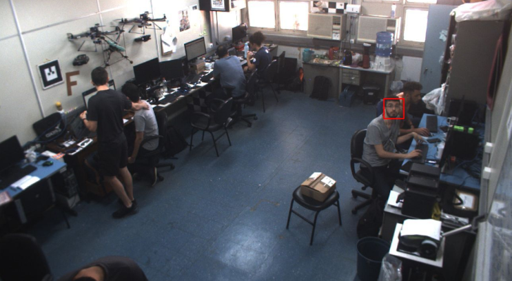

# Face Detector Service

## About :smile:

This service detect faces in images.

> Object Detection using Haar feature-based cascade classifiers is an effective object detection method proposed by Paul Viola and Michael Jones in their paper, "Rapid Object Detection using a Boosted Cascade of Simple Features" in 2001. It is a machine learning based approach where a cascade function is trained from a lot of positive and negative images. It is then used to detect objects in other images. [See more](https://docs.opencv.org/master/db/d28/tutorial_cascade_classifier.html)

In the link above you can find an explanation and simple examples about Object Detection using Haar feature-based cascade classifiers.

[opencv/data/haarcascades](https://github.com/opencv/opencv/tree/master/data/haarcascades) already contains many pre-trained classifiers for face, eyes, smiles, etc. Here we provide cascade classifiers only for face detection:

* `haarcascade_frontalface_default.xml`
* `haarcascade_frontalface_alt.xml`
* `haarcascade_frontalface_alt2.xml`
* `haarcascade_frontalface_alt_tree.xml`

The files are download using the script in [`etc/model/download_models.sh`](https://github.com/labviros/is-face-detector/blob/master/etc/model/download_models.sh). You can choose the scale factor, minimal neighboors and minimal size for the cascade classifier of your choice.

## Streams :camera:

A stream is a program that consumes messages with a specific topic, processes and publishes messages with another topics, so if a other service wants to use the informations provided  by this service, it can simply subscribe for receive messages with the topic of interest.

The python script responsible for the stream in the table below can be found in [`src/is_face_detector/stream.py`](https://github.com/labviros/is-face-detector/blob/master/src/is_face_detector/stream.py).

| Name | ⇒ Input | Output  ⇒ | Description
| --- |--- | --- | --- |
|Face.Detection |  :incoming_envelope: **topic:** `CameraGateway.(camera_id).Frame`   :gem: **schema:** [Image] | :incoming_envelope: **topic:**  `FaceDetector.(camera_id).Detection`   :gem: **schema:**  [ObjectAnnotations] | Detect face on images published by cameras and publishes an ObjectAnnotations message containing all the face detected
|Face.Detection | :incoming_envelope: **topic:** `CameraGateway.(camera_id).Frame`   :gem: **schema:** [Image]| :incoming_envelope: **topic:** `FaceDetector.(camera_id).Rendered`   :gem: **schema:** [Image]| After detection, faces are drew on input image and published for visualization.

- Note: run the `is-face-detector-stream` in container to use this function.

## RPCs :camera_flash:

RPC, or Remote Procedure Call, provided here acts as a remote server that binds a specific function to a topic. So, you can process an [Image] by sending the message to the topic of this service. It will processed and you will receive a response, which can be the faces detected in an [ObjectAnnotations], error, timeout, etc...

The python script responsible for the RPC in the table below can be found in [`src/is_face_detector/rpc.py`](https://github.com/labviros/is-face-detector/blob/master/src/is_face_detector/rpc.py).

| Service | Request | Reply | Description |
| ------- | ------- | ------| ----------- |
| :incoming_envelope: **topic:** `FaceDetector.Detect`|  :gem: **schema:** [Image] | :gem: **schema:** [ObjectAnnotations] | Same purpose of stream shown above, but offered with a RPC server. |

- Note: run the `is-face-detector-rpc` in container to use this function.

## Configuration :gear:

The behavior of the service can be customized by passing a JSON configuration file as the first argument, e.g: `is-face-detector-stream config.json`. The schema for this file can be found in [`src/conf/options.proto`](https://github.com/labviros/is-face-detector/blob/master/src/conf/options.proto).

An example configuration file can be found in [`etc/conf/options.json`](https://github.com/labviros/is-face-detector/blob/master/etc/conf/options.json).

